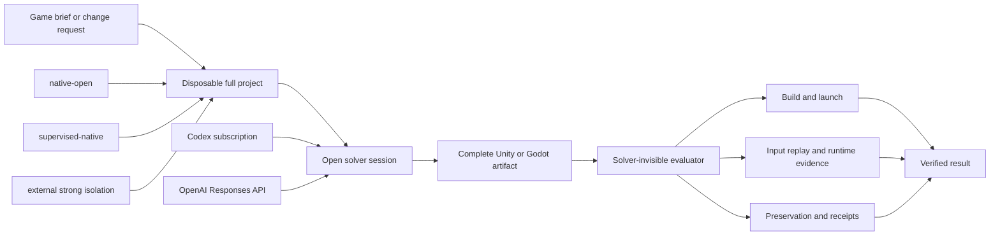
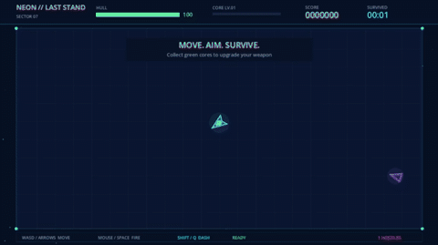
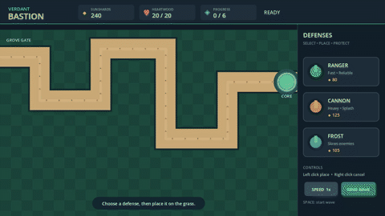
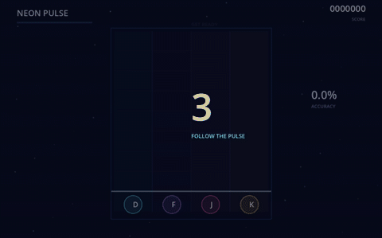
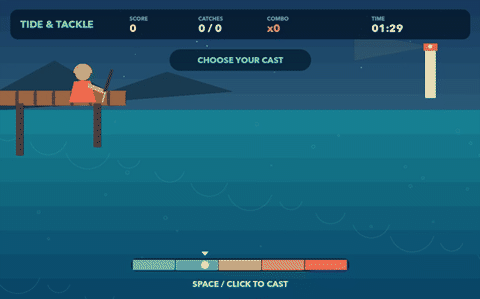
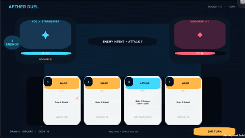
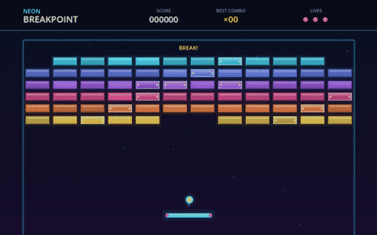

# GameForge Harness

<p align="center">
  <strong>Open execution for game agents. Independent proof for the games they deliver.</strong>
</p>

<p align="center">
  <a href="https://github.com/AlbusChen/GameForge-Harness/actions/workflows/ci.yml"></a>
  <a href="LICENSE"></a>
  
  
</p>

<p align="center">
  <a href="README.zh-CN.md">简体中文</a> ·
  <a href="https://albuschen.github.io/GameForge-Harness/">Project page</a> ·
  <a href="docs/gameforge-report.pdf">Paper (PDF)</a> ·
  <a href="#results">Results</a> ·
  <a href="#playable-showcases">Showcases</a> ·
  <a href="#quick-start">Quick start</a> ·
  <a href="docs/harness-evaluation-index.md">Evaluation</a>
</p>

GameForge is a **game-development harness designed for different game engines**. It is currently
fully tested on Unity and Godot, with support for additional engines such as Unreal planned for
the future. GameForge gives a capable model a complete disposable project and the freedom to use
its native coding, shell, image, and official engine tools. After the model finishes, a separate
evaluator builds, launches, replays, records, and verifies the resulting game.

The central design choice is simple:

> **Do not prescribe how the model builds the game. Do not let the model decide whether the game
> works.**

GameForge is not another fixed game-agent workflow and it is not a collection of engine-specific
prompt tricks. The harness owns the reproducible project boundary, engine lifecycle, execution
profile, receipts, and independent evidence; the solver owns exploration and implementation.

## Why GameForge

- **Freedom–verification separation.** No mandatory tool order, task router, hidden-answer hint,
  intermediate acceptance loop, or harness-authored repair pass is required.
- **Game-native delivery.** The output is a complete Unity or Godot project, not just a patch or a
  chat answer. Gates can cover import, compilation, standalone build, player launch, input replay,
  runtime logs, screenshots, and video.
- **One pipeline, thin engine adapters.** Unity and Godot share the same workspace, backend,
  authority, budget, receipt, and result contracts. Adapters only handle project detection, pinned
  engine resolution, and engine-native final evaluation.
- **Replaceable solvers.** Use a saved Codex subscription login or the OpenAI Responses API. The
  backend contract is intentionally separate from the engine and evaluator.
- **Explicit authority choices.** `native-open` maximizes capability; `supervised-native` brokers
  pinned engine processes; `strong-isolated` delegates execution to a user-supplied VM, container,
  or remote runner and fails closed if it is missing.
- **Evidence-grade failure attribution.** Solver errors, engine/build failures, host infrastructure,
  runtime defects, evaluator failures, and playability evidence remain distinct.

## How it works



The model can inspect files, write its own helpers, call the official engine, capture screenshots,
and change strategy based on real feedback. The final evaluator is outside that loop and does not
expose private acceptance data to the solver.

## Results

GameForge reports two complementary result classes through the same open-solver and independent-
evaluator contract:

| Result class | What it asks | How it is evaluated |
| --- | --- | --- |
| **Benchmark results** | Can the harness solve fixed, repeatable game-development tasks competitively? | Frozen task sets, predefined evaluators or rubrics, and paired baselines |
| **Open-ended results** | Can the same harness turn broad game briefs into working games without prescribing the implementation path? | Empty or minimal projects, independent engine hard gates, blinded quality review, and gameplay evidence |

In both modes, the task or brief defines the goal while the solver remains free to choose its files,
tools, engine commands, validation strategy, and implementation sequence.

### Benchmark results

#### GameCraft-Bench full140

The current unified `native-open` harness completed the full public
[GameCraft-Bench](https://github.com/FreedomIntelligence/gamecraft-bench) suite with the same solver
label as the published Codex row: **GPT-5.6 Sol, high reasoning**.

| Full140 metric | GameForge | Published Codex | Difference |
| --- | ---: | ---: | ---: |
| Overall | **63.15%** | 60.50% | **+2.65 pp** |
| Core Mechanics | **76.15%** | 74.50% | +1.65 pp |
| Content Depth | **58.85%** | 56.10% | +2.75 pp |
| Functional Visuals | **68.74%** | 64.80% | +3.94 pp |
| Presentation & Art | **59.40%** | 57.00% | +2.40 pp |

| Delivery evidence | Result |
| --- | ---: |
| Solver completions | **140 / 140** |
| Official builds | **140 / 140** |
| Official interaction replays | **732 / 732** |
| Infrastructure failures | **0** |
| Harness repair passes | **0** |

> [!IMPORTANT]
> **63.15% is a disclosed subscription-judge approximation, not a leaderboard submission.** The
> official build, replay, frame sampling, rubrics, aggregation, and formula were retained, and the
> benchmark's default GPT-5.5 visual judge was retained.

See the [full protocol and evaluation report](docs/gamecraft-bench-full140-unified-native-open-evaluation-2026-08-28.md).
The saved replay frames can be rescored with the official API judge without rerunning the solver or
Godot.

#### GameDevBench full332

GameForge, using its minimal-open configuration, was evaluated on the same 332 locally qualified
[GameDevBench](https://github.com/waynchi/gamedevbench) tasks as the local Official condition.

| Same-task Full332 | Pass | Pass rate |
| --- | ---: | ---: |
| GameForge | **213 / 332** | **64.16%** |
| Local Official | 184 / 332 | 55.42% |
| Difference | **+29 tasks** | **+8.73 pp** |

The paired result is statistically significant (two-sided exact McNemar `p = 4.8736e-06`; task-
family clustered 95% interval `+5.65` to `+12.25` pp). It is also an important limitation:
GameForge used **52.8% more tokens and 33.3% more solver time** than local Official. The full result
therefore supports a performance advantage, not an efficiency advantage.

See the [complete comparison](docs/gamedevbench-full332-evaluation-2026-08-21.md).

### Open-ended results

These suites start from an empty or minimal project and a natural-language game brief. The brief
does not prescribe node names, source layout, APIs, tool order, intermediate gates, or a solver
workflow.

| Open-ended suite | Scope | Solver completion | Independent delivery evidence | Quality interpretation |
| --- | --- | ---: | ---: | --- |
| **Godot Open20** | 20 game genres from empty projects | **20 / 20** | **20 / 20** import/runtime hard gates | Blinded quality 15.15/16 versus local Official 14.85/16; quality parity, not a superiority claim |
| **Unity Open20** | 20 game genres from a minimal project | **20 / 20** | **20 / 20** import/compile/build/player hard gates; 40/40 valid evaluator screenshots | Capability showcase; no Official A/B |

The curated playable audit adds interaction evidence for generated artifacts: eight Godot games
with engine-level input replay, one Unity game with OS-native mouse/keyboard replay, and four Unity
games with disclosed project-authored behavior smoke replays. Open-ended hard gates establish
buildable and launchable delivery; they do not claim that every title received a complete human
playthrough or reached commercial quality.

See the [Godot Open20 report](docs/godot-open20-unified-native-open-evaluation-2026-08-24.md),
the [Unity Open20 report](docs/unity-open-game-creation20-showcase-2026-08-25.md), and the
[playable evidence index](showcases/README.md).

## Playable showcases

The animated previews play automatically on GitHub. Click one to open the complete MP4 replay; the
repository also includes static preview frames, input traces, and machine-readable receipts.

<table>
  <tr>
    <td width="50%" align="center">
      <a href="showcases/godot/arena-survivor/gameplay.mp4"></a><br>
      <strong>Arena Survivor · Godot</strong><br>
      Movement, aiming, continuous fire, dash, score progression
    </td>
    <td width="50%" align="center">
      <a href="showcases/godot/tower-defense/gameplay.mp4"></a><br>
      <strong>Tower Defense · Godot</strong><br>
      Tower placement, wave start, enemies, combat, speed control
    </td>
  </tr>
  <tr>
    <td width="50%" align="center">
      <a href="showcases/godot/rhythm-game/gameplay.mp4"></a><br>
      <strong>Rhythm Game · Godot</strong><br>
      Four-lane input replay with live score and accuracy changes
    </td>
    <td width="50%" align="center">
      <a href="showcases/godot/fishing-challenge/gameplay.mp4"></a><br>
      <strong>Fishing Challenge · Godot</strong><br>
      Cast, hook, reel, directional counterplay, tension feedback
    </td>
  </tr>
  <tr>
    <td width="50%" align="center">
      <a href="showcases/unity/deckbuilding-duel-native/gameplay.mp4"></a><br>
      <strong>Deckbuilding Duel · Unity</strong><br>
      OS-native clicks and keyboard input advance combat to turn 2
    </td>
    <td width="50%" align="center">
      <a href="showcases/godot/brick-breaker/gameplay.mp4"></a><br>
      <strong>Brick Breaker · Godot</strong><br>
      Launch, paddle control, collisions, score and life changes
    </td>
  </tr>
</table>

[Browse all 13 showcase evidence cases →](showcases/README.md)

The evidence classes are intentionally not conflated: Godot cases use engine-level input replay;
the highlighted Unity case uses macOS CoreGraphics mouse/keyboard events; four additional Unity
cases use project-authored behavior smoke replays.

## Quick start

### Requirements

- Python 3.11 or 3.12
- [`uv`](https://docs.astral.sh/uv/)
- Git
- Godot or Unity when running the corresponding engine adapter
- A supported solver login: local Codex subscription **or** `OPENAI_API_KEY`

### Install from source

```bash
git clone https://github.com/AlbusChen/GameForge-Harness.git
cd GameForge-Harness
uv sync --locked --all-groups
uv run gameforge --help
```

Build or install the local package:

```bash
uv build
uv tool install .
```

### Choose a solver backend

Use the local Codex executable and its saved ChatGPT/Codex login:

```bash
cp config/model.subscription.example.yaml config/model.local.yaml
# Set `executable` and choose any supported model in model.local.yaml.
```

Or use the OpenAI Responses API:

```bash
cp config/model.responses-api.example.yaml config/model.local.yaml
export OPENAI_API_KEY="..."
```

Credentials stay in the host environment. Do not put API keys in YAML, prompts, traces, or the
repository. Subscription and API execution are both supported, but they have different billing and
authentication semantics.

### Run an open game task

```bash
uv run gameforge run-game-workspace \
  --project /path/to/your/game-project \
  --engine auto \
  --request "Add a playable dash mechanic with visible cooldown feedback." \
  --model-profile config/model.local.yaml
```

`--engine auto` recognizes standard Unity and Godot project markers. The original project is kept
separate from the disposable run workspace. Each run records the normalized request and profile,
before/after project state, passive tool audit, engine receipt, evaluator result, usage, failure
classification, and artifact hashes.

To run a pinned GameDevBench task through the same minimal-open contract:

```bash
uv run gameforge benchmark-gamedevbench-minimal \
  --benchmark-root /path/to/GameDevBench \
  --task task_0001 \
  --model-profile config/model.local.yaml
```

## Backends and execution profiles

Authentication and execution authority are orthogonal:

| Choice | Configuration | Meaning |
| --- | --- | --- |
| Codex subscription | `provider: codex-subscription` | Uses the configured local executable and its saved login; no API key is implied. |
| OpenAI API | `provider: openai-responses-api` | The harness owns a standard Responses API tool loop; normal API billing applies. |
| Native open | `execution_profile: native-open` | Default. Maximum tool/engine freedom in a disposable project, with host authority. |
| Supervised native | `execution_profile: supervised-native` | General work stays workspace-scoped; only pinned engine processes cross a transparent host broker. |
| Strong isolated | `execution_profile: strong-isolated` | Delegates to a user-supplied VM/container/remote runner; fails closed without a valid attestation. |

Read [authentication and execution contracts](docs/AUTHENTICATION_AND_EXECUTION.md) and the
[external isolation runner protocol](docs/ISOLATION_RUNNER_PROTOCOL.md) before deployment.

## Security boundary

> [!WARNING]
> `native-open` is intentionally **not an OS security sandbox**. Model commands and generated game
> code run with the host user's authority. Use it only with trusted models, projects, and tasks.

`supervised-native` narrows engine provenance and lifecycle but does not make arbitrary generated
Unity C# or Godot scripts safe. `strong-isolated` is the intended boundary for untrusted code, but
GameForge currently defines the fail-closed provider interface rather than bundling a specific VM
or container runtime. See [Security](SECURITY.md) and the [detailed model](docs/security.md).

## Repository map

| Path | Contents |
| --- | --- |
| `gameforge/` | Installable harness, adapters, contracts, evaluators, and CLI |
| `config/` | Subscription/API and execution-profile examples |
| `benchmarks/` | Benchmark manifests and authored suites |
| `showcases/` | Curated videos, previews, traces, and receipts |
| `docs/` | Current architecture, operations, security, and evaluation reports |
| `experiments/` | Reproduction, scoring, and audit utilities |
| `unity/` | Unity bridge, tested arena project, and minimal creation template |
| `tests/` | Contract, adapter, policy, and runner regression tests |

## Scope and current limitations

- Unity and Godot are currently fully tested; support for engines such as Unreal is planned.
- The project does not claim that automated checks can prove a game is fun or commercially ready.
- Unity20 proves build/player delivery breadth, not 20 complete real-input playthroughs.
- A concrete strong-isolation provider is not bundled yet.

The repository root is the only distributed GameForge source tree. The
[evaluation index](docs/harness-evaluation-index.md) links the current benchmark, open-ended, and
playable evidence. New benchmark claims should always name the exact release commit, model,
reasoning effort, task set, engine/evaluator version, retries, and judge transport.

## Development

```bash
uv sync --locked --all-groups
uv run ruff check .
uv run pytest
uv build
```

See [CONTRIBUTING.md](CONTRIBUTING.md) for contribution rules. The project is alpha software and
welcomes reproducibility fixes, new thin engine adapters, independent evaluators, isolation
providers, and carefully controlled benchmark replications.

## Acknowledgements

The research and evaluation path builds on
[GameCraft-Bench](https://github.com/FreedomIntelligence/gamecraft-bench),
[GameDevBench](https://github.com/waynchi/gamedevbench), and ideas from open agent/evaluation
projects including [Harbor](https://github.com/harbor-framework/harbor),
[Prime Agent](https://github.com/PrimeIntellect-ai/prime-agent), and
[OpenHands](https://github.com/OpenHands/software-agent-sdk). These projects operate at different
layers; GameForge focuses on the game-project boundary and independent engine/runtime evidence.

## License

Apache License 2.0. See [LICENSE](LICENSE).

## Citation

If you use GameForge in your research, please cite the [technical report](docs/gameforge-report.pdf):

> Huang, C. (2026). *GameForge: Open-Ended Game Development with Independent Artifact Verification*.
> Technical report, Singapore University of Technology and Design.

```bibtex
@techreport{huang2026gameforge,
  author      = {Huang, Chen},
  title       = {{GameForge}: Open-Ended Game Development with Independent Artifact Verification},
  institution = {Singapore University of Technology and Design},
  year        = {2026},
  url         = {https://github.com/AlbusChen/GameForge-Harness/blob/main/docs/gameforge-report.pdf}
}
```

For reproducibility of the software version, you can additionally cite the [v0.1.0 release](https://github.com/AlbusChen/GameForge-Harness/releases/tag/v0.1.0):

```bibtex
@misc{huang2026gameforge_software,
  author       = {Huang, Chen},
  title        = {GameForge Harness: Open Execution and Independent Verification for Game Agents},
  year         = {2026},
  month        = aug,
  howpublished = {GitHub},
  note         = {Version 0.1.0, computer software},
  url          = {https://github.com/AlbusChen/GameForge-Harness/releases/tag/v0.1.0}
}
```
