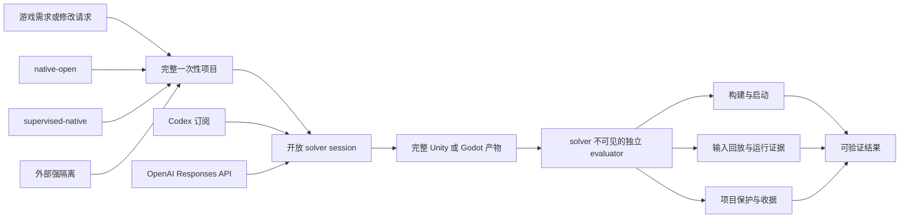

# GameForge Harness

<p align="center">
  <strong>给游戏 Agent 开放的执行空间，给游戏交付独立、可复现的证明。</strong>
</p>

<p align="center">
  <a href="README.md">English</a> ·
  <a href="https://albuschen.github.io/GameForge-Harness/">项目主页</a> ·
  <a href="#实验结果">实验结果</a> ·
  <a href="#可玩案例">可玩案例</a> ·
  <a href="#快速开始">快速开始</a> ·
  <a href="docs/harness-evaluation-index.md">评测</a>
</p>

GameForge 是一个**面向多种游戏引擎的游戏开发 Harness**。目前已在 Unity 和 Godot 上完成
充分测试，未来计划支持 Unreal 等更多引擎。它给模型一个完整的一次性游戏项目，让模型自由
使用原生编程、Shell、图像和官方引擎工具；模型结束后，再由独立 evaluator 构建、启动、回放、
录制和验证最终游戏。

核心原则是：

> **不规定模型应该怎样做游戏，也不让模型自己决定游戏是否成功。**

GameForge 不是固定的游戏 Agent 流程，也不是一组引擎题目特例。Harness 管理可复现项目边界、引擎
生命周期、权限选择、收据与独立证据；solver 自己负责探索与实现。

## 为什么需要 GameForge

- **自由与验证分离**：不要求固定工具顺序、任务路由、中间验收循环或 Harness 自动修题。
- **交付完整游戏产物**：结果是完整 Unity/Godot 项目，而不是聊天答案或单个代码 diff；最终 gate
  可以覆盖导入、编译、独立构建、Player 启动、输入回放、日志、截图和视频。
- **统一 pipeline、薄引擎适配**：Unity/Godot 共用 workspace、backend、权限、预算、receipt 和
  result contract；adapter 只处理项目识别、固定引擎和引擎原生最终评测。
- **可替换 solver**：同时支持本地 Codex 订阅登录与 OpenAI Responses API。
- **明确的权限选择**：默认 `native-open` 保留最大能力；`supervised-native` 托管固定引擎进程；
  `strong-isolated` 接入用户提供的 VM/container/remote runner，缺失时 fail closed。
- **可审计的失败归因**：solver、Host infrastructure、引擎构建、runtime defect、evaluator 和可玩性
  证据不会混成一个笼统失败。

## 工作方式



模型可以自行检查文件、写辅助工具、调用官方引擎、看截图，并根据真实反馈改变策略。最终 evaluator
位于解题循环之外，不向 solver 暴露私有验收信息。

## 实验结果

GameForge 通过同一套“开放 solver + 独立 evaluator”契约报告两类互补结果：

| 结果类型 | 回答的问题 | 评测方式 |
| --- | --- | --- |
| **Benchmark 结果** | Harness 能否在固定、可重复的游戏开发任务上保持有竞争力的表现？ | 冻结任务集、预定义 evaluator 或 rubric，以及配对 baseline |
| **开放式结果** | 同一 Harness 能否在不规定实现路线的情况下，把宽泛游戏 brief 交付成可运行游戏？ | 空白或最小项目、独立引擎 hard gate、匿名质量评审和玩法证据 |

两种模式都只规定目标；solver 仍可自由选择文件、工具、引擎命令、验证方法和实现顺序。

### Benchmark 结果

#### GameCraft-Bench full140

当前统一 `native-open` Harness 使用与公开 Codex 行相同的 solver：**GPT-5.6 Sol / high**，完成了
[GameCraft-Bench](https://github.com/FreedomIntelligence/gamecraft-bench) 全部 140 题。

| Full140 指标 | GameForge | 公开 Codex | 差值 |
| --- | ---: | ---: | ---: |
| Overall | **63.15%** | 60.50% | **+2.65 pp** |
| Core Mechanics | **76.15%** | 74.50% | +1.65 pp |
| Content Depth | **58.85%** | 56.10% | +2.75 pp |
| Functional Visuals | **68.74%** | 64.80% | +3.94 pp |
| Presentation & Art | **59.40%** | 57.00% | +2.40 pp |

- 140/140 solver 完成；
- 140/140 官方构建通过；
- 732/732 官方交互轨迹回放成功；
- 0 infrastructure failure；
- 0 Harness repair pass。

> [!IMPORTANT]
> **63.15% 是披露过评分差异的订阅 judge 近似分，不是 leaderboard 提交。** 官方 build、replay、
> 抽帧、rubric、聚合和公式保持不变，GameCraft 默认 GPT-5.5 视觉 judge 也保持不变。

完整协议和限制见 [full140 中文报告](docs/gamecraft-bench-full140-unified-native-open-evaluation-2026-08-28.md)。

#### GameDevBench full332

GameForge 使用 minimal-open 配置，与本地 Official 在完全相同的 332 个
[GameDevBench](https://github.com/waynchi/gamedevbench) 任务上对比：

| 条件 | PASS | 通过率 |
| --- | ---: | ---: |
| GameForge | **213/332** | **64.16%** |
| 本地 Official | 184/332 | 55.42% |
| 差值 | **+29 题** | **+8.73 pp** |

配对差异显著（McNemar exact 双侧 `p = 4.8736e-06`；任务族聚类 95% 区间 `+5.65` 到
`+12.25` pp）。但 GameForge 比 Official 多用 52.8% token、总 solver 时间多 33.3%，所以这里成立的是
performance 卖点，不是 efficiency 卖点。

详见 [Full332 对比报告](docs/gamedevbench-full332-evaluation-2026-08-21.md)。

### 开放式结果

这些套件从空白或最小项目和自然语言游戏 brief 开始。Brief 不规定节点名、源码布局、API、工具顺序、
中间 gate 或 solver 工作流。

| 开放式套件 | 范围 | Solver 完成 | 独立交付证据 | 质量解释 |
| --- | --- | ---: | ---: | --- |
| **Godot Open20** | 从空项目创建 20 种游戏 | **20/20** | **20/20** import/runtime hard gate | 匿名质量 15.15/16，对本地 Official 14.85/16；结论是质量相当，不宣称质量优势 |
| **Unity Open20** | 从最小项目创建 20 种游戏 | **20/20** | **20/20** import/compile/build/player hard gate；40/40 有效 evaluator 截图 | 能力 showcase；没有 Official A/B |

精选试玩审计进一步为生成产物补充了交互证据：8 个 Godot 游戏通过引擎级输入回放，1 个 Unity 游戏
通过操作系统原生键鼠回放，另有 4 个 Unity 游戏使用明确披露的项目自带行为 smoke。开放式 hard gate
证明项目能够构建和启动，但不代表每个游戏都经过完整人工通关，也不等于商业级质量。

详见 [Godot Open20 报告](docs/godot-open20-unified-native-open-evaluation-2026-08-24.md)、
[Unity Open20 报告](docs/unity-open-game-creation20-showcase-2026-08-25.md)和
[试玩证据索引](showcases/README.md)。

## 可玩案例

GIF 玩法预览会在 GitHub 首页自动循环播放；点击预览可以打开完整 MP4 回放。仓库同时保存静态
preview、输入轨迹和机器可读 receipt。

<table>
  <tr>
    <td width="50%" align="center"><a href="showcases/godot/arena-survivor/gameplay.mp4"></a><br><strong>Arena Survivor · Godot</strong></td>
    <td width="50%" align="center"><a href="showcases/godot/tower-defense/gameplay.mp4"></a><br><strong>Tower Defense · Godot</strong></td>
  </tr>
  <tr>
    <td width="50%" align="center"><a href="showcases/godot/rhythm-game/gameplay.mp4"></a><br><strong>Rhythm Game · Godot</strong></td>
    <td width="50%" align="center"><a href="showcases/godot/fishing-challenge/gameplay.mp4"></a><br><strong>Fishing Challenge · Godot</strong></td>
  </tr>
  <tr>
    <td width="50%" align="center"><a href="showcases/unity/deckbuilding-duel-native/gameplay.mp4"></a><br><strong>Deckbuilding Duel · Unity</strong></td>
    <td width="50%" align="center"><a href="showcases/godot/brick-breaker/gameplay.mp4"></a><br><strong>Brick Breaker · Godot</strong></td>
  </tr>
</table>

[查看全部 13 个 showcase 证据案例 →](showcases/README.md)

Godot 案例使用引擎级 InputEvent 回放；高亮的 Unity 案例使用 macOS CoreGraphics 真实鼠标/键盘事件；
另外 4 个 Unity 案例是项目自带行为 smoke。

## 快速开始

要求：Python 3.11/3.12、[`uv`](https://docs.astral.sh/uv/)、Git，以及要运行的 Unity 或 Godot。

```bash
git clone https://github.com/AlbusChen/GameForge-Harness.git
cd GameForge-Harness
uv sync --locked --all-groups
uv run gameforge --help
```

使用本地 Codex 订阅登录：

```bash
cp config/model.subscription.example.yaml config/model.local.yaml
# 在 model.local.yaml 中设置 executable 和模型。
```

或使用 OpenAI Responses API：

```bash
cp config/model.responses-api.example.yaml config/model.local.yaml
export OPENAI_API_KEY="..."
```

运行一个开放游戏任务：

```bash
uv run gameforge run-game-workspace \
  --project /path/to/your/game-project \
  --engine auto \
  --request "增加一个可玩的冲刺机制，并提供清晰的冷却反馈。" \
  --model-profile config/model.local.yaml
```

`--engine auto` 根据标准项目标记识别 Unity/Godot。原项目与一次性运行副本分开；每次运行记录标准化
请求、模型/profile、前后项目状态、被动工具审计、引擎 receipt、独立 evaluator、usage、失败归因和
artifact hash。

## Backend 与执行权限

| 选择 | 配置 | 含义 |
| --- | --- | --- |
| Codex 订阅 | `provider: codex-subscription` | 使用本地可执行文件及其保存的登录；不等同于 API key。 |
| OpenAI API | `provider: openai-responses-api` | Harness 持有标准 Responses tool loop；按 API 正常计费。 |
| Native open | `execution_profile: native-open` | 默认；一次性项目内最大工具/引擎自由度，使用 Host 权限。 |
| Supervised native | `execution_profile: supervised-native` | 普通工作限制在 workspace；固定引擎由透明 Host broker 执行。 |
| Strong isolated | `execution_profile: strong-isolated` | 交给用户配置的 VM/container/remote runner；无有效 attestation 时拒绝运行。 |

详细说明见 [认证与执行协议](docs/AUTHENTICATION_AND_EXECUTION.md)和
[外部隔离 runner 协议](docs/ISOLATION_RUNNER_PROTOCOL.md)。

## 安全边界

> [!WARNING]
> 默认 `native-open` **不是 OS 安全沙箱**。模型命令和生成的游戏代码拥有 Host 用户权限，只应运行
> 可信模型、项目和任务。

`supervised-native` 可以改善固定引擎来源与生命周期，但不会让任意生成的 Unity C# 或 Godot 脚本变成
安全代码。处理不可信代码应使用外部 `strong-isolated` provider；当前项目定义并测试了 fail-closed
接口，但尚未捆绑具体 VM/container provider。参见 [SECURITY.md](SECURITY.md)和
[详细安全模型](docs/security.md)。

## 当前边界

- 目前已在 Unity 和 Godot 上完成充分测试，未来计划支持 Unreal 等更多引擎；
- 自动 gate 不能证明游戏主观好玩或达到商业质量；
- Unity20 证明构建/Player 交付广度，不等于 20 个真实输入完整 playthrough；
- 尚未内置具体强隔离 provider。

仓库根目录是唯一对外交付的 GameForge 源码树。[评测索引](docs/harness-evaluation-index.md)
只链接当前 benchmark、开放创建和试玩证据。

## 开发

```bash
uv sync --locked --all-groups
uv run ruff check .
uv run pytest
uv build
```

项目采用 Apache-2.0 许可证，见 [LICENSE](LICENSE)。

## 引用

如果你使用了 GameForge Harness 或其中的评测 fixtures，请引用对应的软件版本：

> Huang, C. (2026). *GameForge Harness: Open execution and independent verification for game
> agents* (Version 0.1.0) [Computer software]. GitHub.
> https://github.com/AlbusChen/GameForge-Harness/releases/tag/v0.1.0

```bibtex
@misc{huang2026gameforge,
  author       = {Huang, Chen},
  title        = {GameForge Harness: Open Execution and Independent Verification for Game Agents},
  year         = {2026},
  month        = aug,
  howpublished = {GitHub},
  note         = {Version 0.1.0, computer software},
  url          = {https://github.com/AlbusChen/GameForge-Harness/releases/tag/v0.1.0}
}
```
